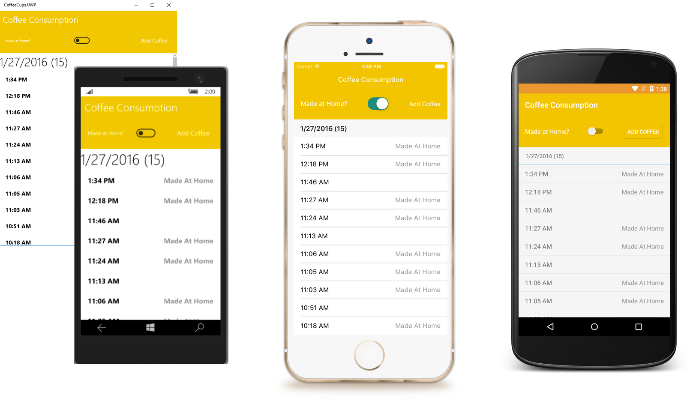

## Coffee Cups App!

## What is this?
Sample application built with Xamarin.Forms for iOS, Android, and Windows 10 UWP showcasing simple data binding and tying into Azure Mobile Apps and Easy Tables. 

Built with C# 6 features, you must be running VS 2015 or Xamarin Studio to compile.

## Walkthrough:
* Backend Setup: https://www.youtube.com/watch?v=Bi2TxyiK9wM
* Blog: https://blog.xamarin.com/getting-started-azure-mobile-apps-easy-tables/
* Video Demo: https://www.youtube.com/watch?v=r3tUKefwfy0

## Screenshots

#### Contributors
* [jamesmontemagno](https://github.com/jamesmontemagno)

#### Technology Used
* [Xamarin.Forms](http://xamarin.com/forms)
* [Xamarin Insights](http://xamarin.com/insights)
* [Connectivity Plugin](http://github.com/jamesmontemagno/Xamarin.Plugins)
* [Azure Mobile Apps](https://components.xamarin.com/view/azure-mobile-client)
* [MvvmHelpers](https://github.com/jamesmontemagno/mvvm-helpers)
* [Xamarin.Forms Toolkit](https://github.com/jamesmontemagno/xamarin.forms-toolkit)

#### License
Under MIT (See LICENSE.md)
